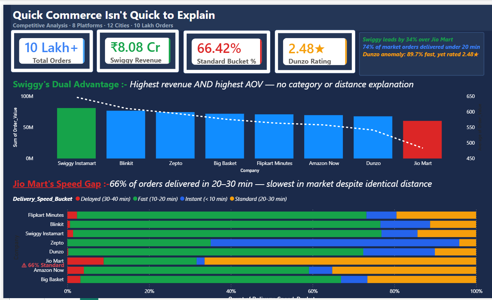
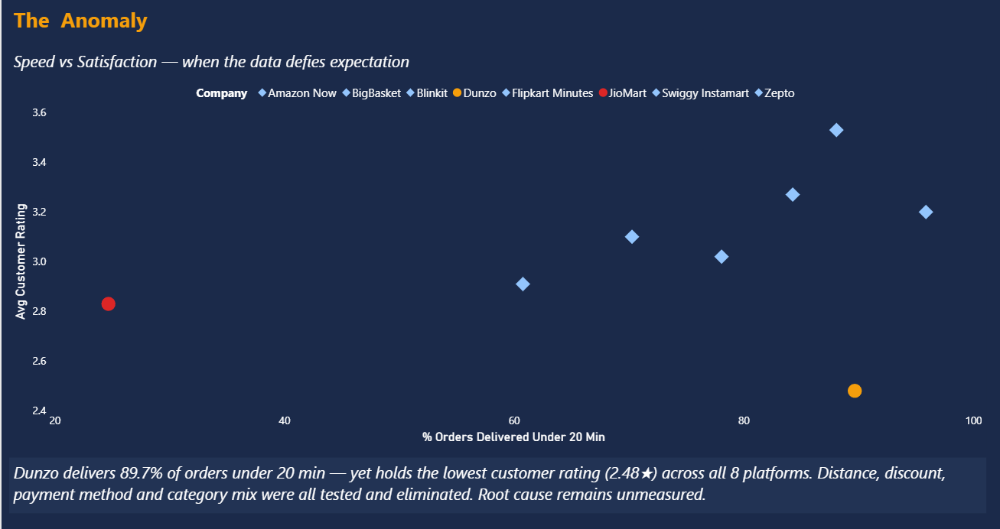

# Quick Commerce Isn't Quick to Explain
### Competitive Analysis — 8 Platforms · 12 Cities · 10 Lakh Orders

> *"I analysed 10 lakh orders across 8 quick commerce platforms and found something counterintuitive — one platform has the fastest delivery in the market but the lowest customer rating. I proposed 4 hypotheses, tested each against actual data, and eliminated all of them with evidence. The conclusion wasn't a clean answer — it was a documented data limitation. Sometimes it's better to accept what the data cannot say than force an answer that could hurt the business."*

---

## Project Overview

This is an end-to-end competitive analysis of the Indian quick commerce market. The goal was not just to rank platforms by revenue — but to diagnose **why** one platform leads, **why** another lags, and **why** one defies every explanation the data can offer.

The entire analysis follows a **hypothesis-first, elimination-based approach** — the same method real business analysts use when investigating performance gaps. Every finding was arrived at by forming a theory, testing it against data, and either confirming or ruling it out with evidence.

---

## The Three Insights

### Insight 1 — Swiggy Instamart's Dual Advantage
Swiggy Instamart leads the market with ₹8.08 Cr in revenue — but the interesting finding is **why**. It's not because of category mix (all platforms sell the same 7 categories in identical proportions). It's not because of delivery distance (all platforms average 7.75 km). Swiggy wins because it simultaneously holds the **highest AOV (₹646 vs market average ₹572)** and **near-highest order volume (1,25,119 orders)**. A 10% AOV lift on current volume alone would generate ₹80.8 Lakhs in incremental revenue — without acquiring a single new customer.

### Insight 2 — Jio Mart's Speed Gap
Jio Mart sits at the bottom of the revenue table at ₹6.03 Cr — a 34% gap from Swiggy. The diagnosis revealed a **dual weakness**: lowest AOV (₹483, which is ₹89 below market average) AND the worst delivery speed profile in the market (66.4% of orders fall in the 20–30 minute Standard bucket). Delivery distance was ruled out — Jio Mart's average distance (7.75 km) is identical to all faster platforms. The bottleneck is operational, not geographic.

### Insight 3 — The Dunzo Anomaly
Dunzo delivers **89.7% of orders in under 20 minutes** — one of the fastest in the market. Yet it holds the **lowest customer rating of all 8 platforms at 2.48★**. This directly contradicts the general market pattern where faster delivery correlates with higher satisfaction. Four hypotheses were tested and eliminated:

| Hypothesis | What Data Showed | Verdict |
|---|---|---|
| Distance — dark stores farther from customers | 7.75 km — identical to all platforms | Ruled out |
| Discount — attracts price-sensitive, harsh raters | 40.15% discount rate — market parity | Ruled out |
| Payment friction — online transaction failures | Rating flat across all 5 payment methods | Ruled out |
| Category mix — products more likely to disappoint | Category distribution identical across all platforms | Ruled out |

**Conclusion:** The root cause is unmeasurable with the current dataset. The likely drivers — item accuracy rate, app UX quality, customer service responsiveness — require operational data columns not present in this analysis. Documenting what the data cannot explain is as important as finding what it can.

---

## Dashboard Preview

**Page 1 — Market Overview**

**Page 2 — The Anomaly**

---

## Tools & Skills Used

| Category | Tools |
|---|---|
| Data Cleaning | Microsoft Excel · Power Query (M Language) |
| Data Modelling | Power Pivot · DAX (Calculated Columns + Measures) |
| Analysis | Pivot Tables · Hypothesis Testing · RCA |
| Visualisation | Power BI Desktop |
| Frameworks | CAR Framework · SCQA · Hypothesis-Elimination Method |
| Documentation | PDF Report · Data Dictionary · Imputation Strategy |

---

## Dataset

| Attribute | Detail |
|---|---|
| Total Rows | 1,000,000 (10 Lakh transactions) |
| Platforms | Blinkit, Swiggy Instamart, Zepto, BigBasket, Dunzo, JioMart, Flipkart Minutes, Amazon Now |
| Cities | Amritsar, Bengaluru, Chennai, Delhi, Gurgaon, Haridwar, Hyderabad, Jaipur, Kolkata, Mumbai, Noida, Pune |
| Columns | 13 (Order_ID, Company, City, Product_Category, Order_Value, Delivery_Time_Min, Distance_Km, Customer_Rating, Delivery_Partner_Rating, Payment_Method, Discount_Applied, Items_Count, Order_Date) |

> **Note:** Dataset not included in this repository due to file size (1 million rows). The dataset is a synthetic simulation of quick commerce transactional data, identified through consistent parity patterns across all platforms during analysis.

---

## Data Cleaning Decisions

| Column | Null % | Decision | Reason |
|---|---|---|---|
| City | 5.2% | Filled with 'Unknown' | City is a label, not a metric — deleting rows would lose valid order data |
| Items_Count | 3.5% | Filled with Median (10) | Symmetric distribution (mean=median=10); whole number appropriate for count data |
| Customer_Rating | 4.7% | Filled with Mean (3.04) | Nulls random across platforms; decimal fill consistent with existing column pattern |
| Delivery_Partner_Rating | 10.4% | Filled with Mean (3.74) | Largest null column; mean chosen for consistency with decimal distribution |

---

## What I Learned

Beyond the technical skills, this project taught me three analytical habits:

1. **Predict before you look.** Forming a hypothesis before pulling data forces you to think about what the answer *should* be — which makes surprises meaningful rather than random.

2. **Ruling things out is a finding.** The Dunzo anomaly produced no confirmed root cause — but it produced four confirmed non-causes. That's not a failure, it's a diagnosis.

3. **Document what the data cannot say.** Every analysis has a boundary. Knowing where yours is — and saying so clearly — is what separates honest analysis from confident guessing.

---

## Connect

**KS Sonu** — Data Analyst  
📧 ks.sonu@outlook.com  
🔗 [LinkedIn](https://linkedin.com/in/ks-sonu/) 
